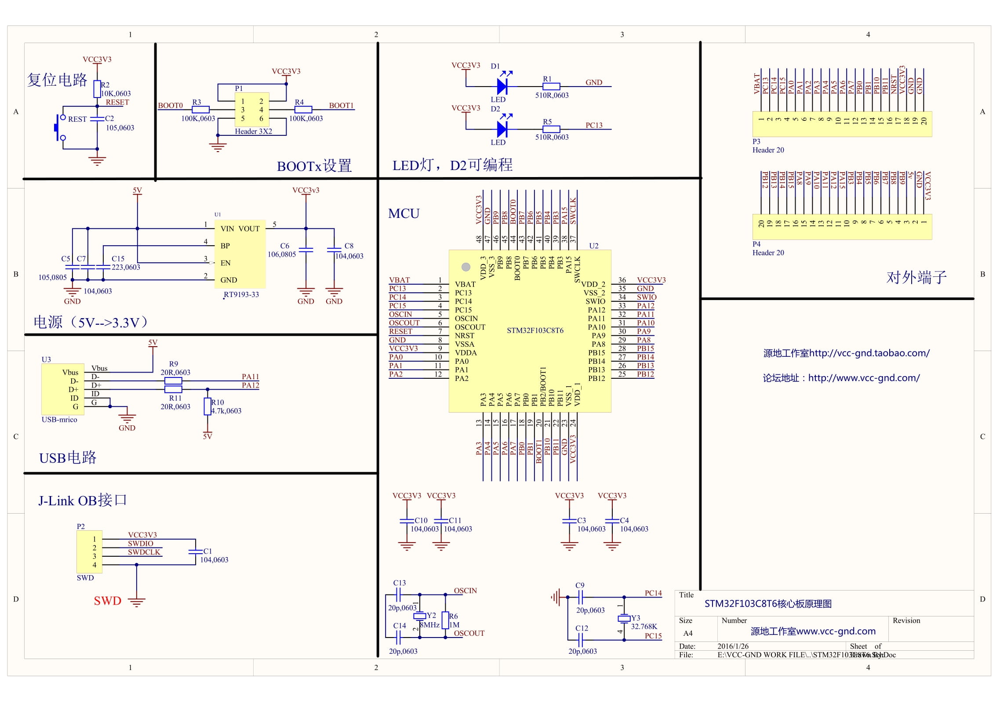
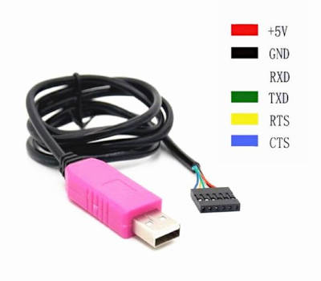

# Getting started with Zephyr RTOS on BluePill board

## Upload

### Using ST-LINK

There are several ways to upload the firmware to this board but the default way is to use the [ST-Link debugger](https://stm32-base.org/guides/connecting-your-debugger.html). 

In linux, you can use the following commands to install the ST-Link drivers:

```console
sudo apt -y install stlink-tools
sudo systemctl restart udev
```
Now you can `Upload` the firmware to the board using [PlaformIO](https://platformio.org/).

### Using USB Bootloader (DFU)

[DFU](https://github.com/devanlai/dapboot) is a simple USB bootloader that can be used to upload the firmware to the board without the need to any additional hardware (e.g. a programmer or debugger).

### Boot Configuration

| Boot 1 | Boot 0 | Boot Mode         | Aliasing                                    |
| ------ | ------ | ----------------- | ------------------------------------------- |
| X      | 0      | Main Flash Memory | Main flash memory is selected as boot space |
| 0      | 1      | System Memory     | System memory is selected as boot space     |
| 1      | 1      | Embedded SRAM     | Embedded SRAM is selected as boot space     |


## Supported Features in Zephyr

The stm32\_min\_dev board configuration supports the following hardware
features:

| Interface | Controller | Driver/Component                     |
| --------- | ---------- | ------------------------------------ |
| NVIC      | on-chip    | nested vectored interrupt controller |
| SYSTICK   | on-chip    | system clock                         |
| UART      | on-chip    | serial port                          |
| GPIO      | on-chip    | gpio                                 |
| I2C       | on-chip    | i2c                                  |
| PWM       | on-chip    | pwm                                  |
| SPI       | on-chip    | spi                                  |
| USB       | on-chip    | USB device                           |
| ADC       | on-chip    | adc                                  |

Other hardware features are not supported by the Zephyr kernel.

### Connections and IOs

#### Default Zephyr Peripheral Mapping:

  - UART\_1 TX/RX: PA9/PA10
  - UART\_2 TX/RX: PA2/PA3
  - UART\_3 TX/RX: PB10/PB11
  - I2C\_1 SCL/SDA : PB6/PB7
  - I2C\_2 SCL/SDA : PB10/PB11
  - PWM\_1\_CH1: PA8
  - SPI\_1 NSS\_OE/SCK/MISO/MOSI: PA4/PA5/PA6/PA7
  - SPI\_2 NSS\_OE/SCK/MISO/MOSI: PB12/PB13/PB14/PB15
  - USB\_DC DM/DP: PA11/PA12
  - ADC\_1: PA0

#### System Clock

The on-board 8Mhz crystal is used to produce a **72Mhz** system clock with
PLL.

#### Serial Port

STM32 Minimum Development Board has 3 U(S)ARTs. The Zephyr console
output is assigned to UART_1. Default settings are **115200 8N1**.

#### On-Board LEDs

The board has one on-board LED that is connected to PB12/PC13 on the
black/blue variants respectively.

## Pinout


## Schematics



## USB to Serial Cable




USB to Serial (UART) cable is used to connect the board to a PC.

| Blue Pill | USB to Serial |
| --------- | ------------- |
| A9 (TX1)  | RXD           |
| A10 (RX1) | TXD           |
| G         | GND           |


### Access to Serial Port in Linux

In order to upload the compiled program to your board you should have access to serial ports. This is done by adding your user to `dialout` and `tty` groups:

```console
sudo usermod -a -G dialout $USER
sudo usermod -a -G tty $USER
```

You can verify if your user is added to `dialout` and `tty` groups using this command:

```console
groups $USER
```

Note: You should log out and log in or reboot your computer to apply the changes.


## Resources

- [Blue Pill - STM32F103C8T6](https://stm32-base.org/boards/STM32F103C8T6-Blue-Pill.html)
- [Getting Started with STM32F103C8T6 Blue Pill](https://www.electronicshub.org/getting-started-with-stm32f103c8t6-blue-pill/)
- [PlatformIO BluePill F103CB](https://docs.platformio.org/en/latest/boards/ststm32/bluepill_f103cb.html)
- [DFU Bootloader for STM32 chips](https://github.com/devanlai/dapboot)
- [Connecting ST-LINK debugger](https://stm32-base.org/guides/connecting-your-debugger.html)
- [How to fix PlatformIO STM32 Error: libusb_open() failed with LIBUSB_ERROR_ACCESS](https://techoverflow.net/2021/09/22/how-to-fix-platformio-stm32-error-libusb_open-failed-with-libusb_error_access/)
- [Zephyr for BluePill Documentation](https://docs.zephyrproject.org/latest/boards/arm/stm32_min_dev/doc/index.html)
- [Zephyr Blinky Sample Application](https://github.com/zephyrproject-rtos/zephyr/blob/main/samples/basic/blinky/src/main.c)
- [Zephyr Tutorial for Beginners](https://github.com/maksimdrachov/zephyr-rtos-tutorial)
- [IoT RTOS Zephyr on cheap STM32 Minimum Development Board](https://embedjournal.com/iot-rtos-zephyr-stm32-minimum-system-development-board/)